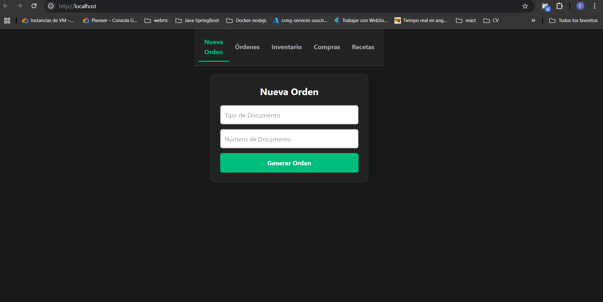
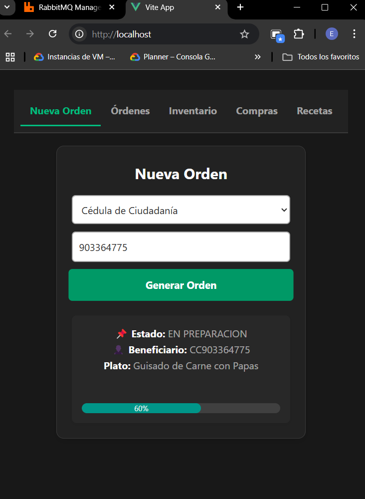
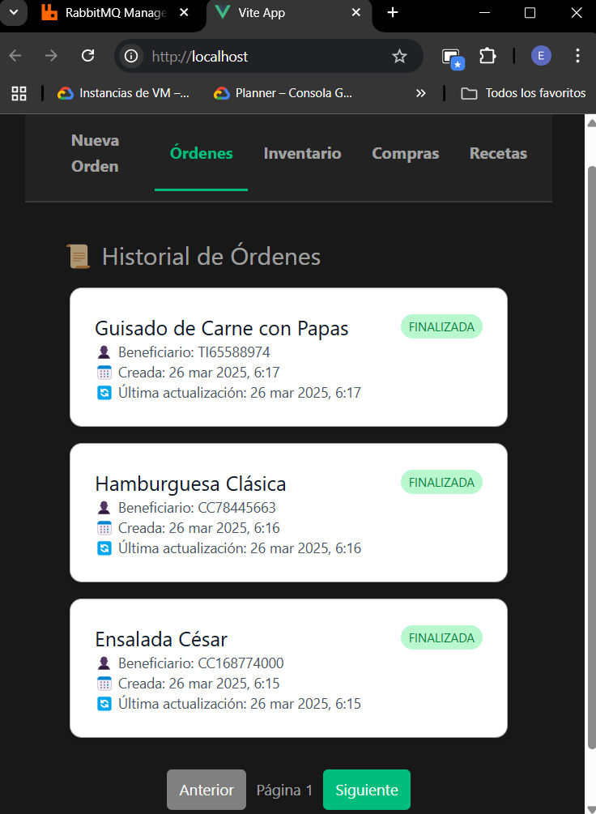
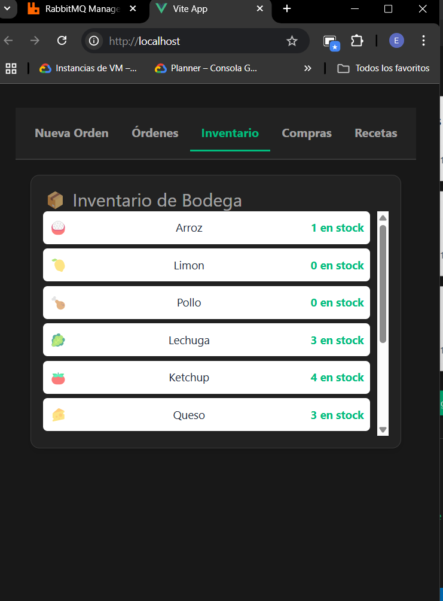
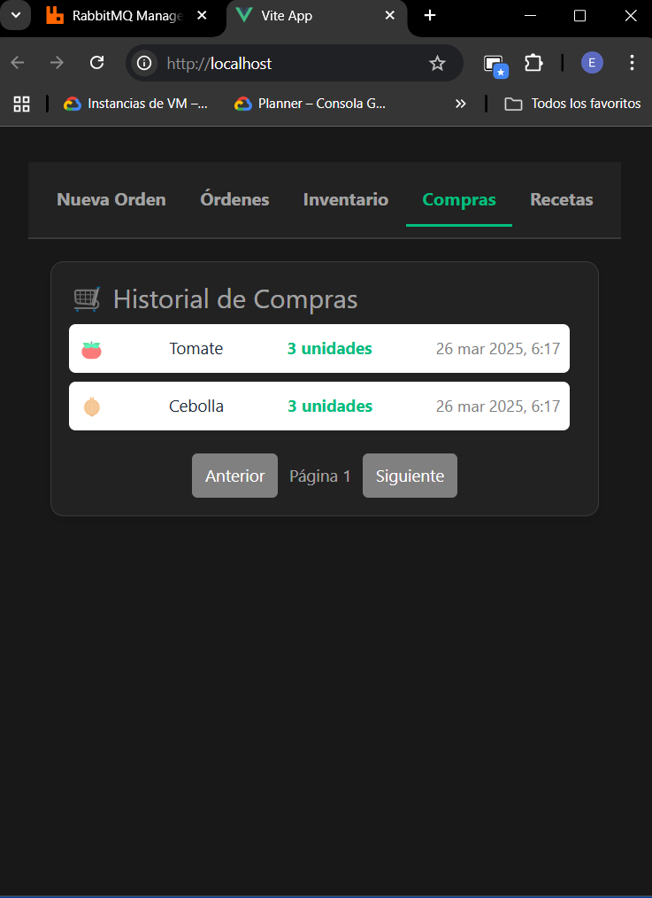
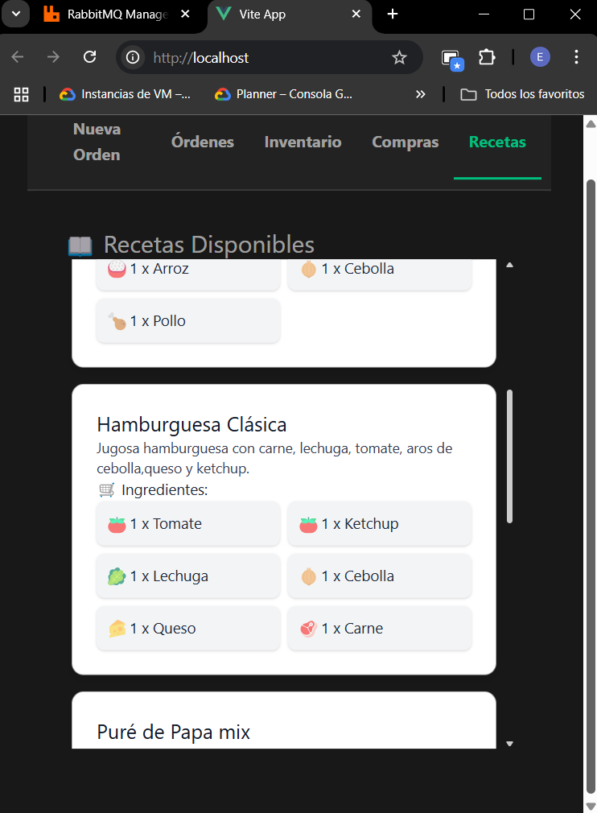

# Documentación del Proyecto

## Descripción General

Este proyecto implementa un sistema de pedidos de platos de comida utilizando una arquitectura de microservicios en **Node.js** sin framework, potenciando la asincronía con una sencilla implmentacion de  WebSockets para actualización en tiempo real. 

Se gestiona la preparación de pedidos con asincronía mediante **RabbitMQ** y se ofrece una interfaz en **Vue.js** sencilla, puesto que la solucion está orientada al Backend.


El sistema de versionamiento del proyecto usa un estilo mono repositorio, donde se encuentran todos los microservicios y la interfaz gráfica y se despliegan en modo multicontenedor con docker-compose.

## Tecnologías Utilizadas

- **Backend:** Node.js (sin Express), RabbitMQ, PostgreSQL
- **Frontend:** Vue.js con Nginx
- **Base de Datos:** PostgreSQL
- **Mensajería Asíncrona:** RabbitMQ
- **Orquestación de Contenedores:** Docker Compose

## Arquitectura

El sistema está compuesto por los siguientes microservicios:

### 1. **Orchestator_ms**

- Recibe las solicitudes de nuevos pedidos desde la UI.
- Gestiona el flujo de eventos y estados de los pedidos.
- Se comunica con **Cooking** para procesar la preparación de los platos.
- Emite eventos **WebSocket** para actualizar la UI en tiempo real.

### 2. **kitchen_manage_ms**

- Selecciona recetas aleatoriamente y solicita ingredientes.
- Valida stock y solicita compras si es necesario.
- Maneja tiempos de preparación de platos simulando tiempos reales.
- Publica eventos sobre el estado de los pedidos.

### 3. **logistic_inventory_ms**

- Gestiona los ingredientes y su disponibilidad en bodega.
- Registra compras de ingredientes desde la API de la plaza de mercado.
- Emite eventos sobre el estado de las compras para que se reanuden las ordenes pendientes.

### 4. **Frontend**

- Interfaz gráfica en **Vue.js** servida con **Nginx**.
- Se conecta por WebSockets a **Orchestator** para recibir actualizaciones en tiempo real sobre los pedidos.
- Muestra el estado de los pedidos, ingredientes y recetas.

## Comunicación entre Microservicios

- **RabbitMQ** se utiliza para la comunicación asíncrona entre microservicios.
- **REST** solo se usa para consultas específicas (ej. compra de ingredientes).
- **WebSockets** permiten actualizar la UI en tiempo real.

## Estructura del Proyecto

```
/backend
  /orchestrator_ms
  /kitchen_manage_ms
  /logistic_inventory_ms
/lunch-front
  /src
  /nginx.conf
/docker-compose.yml
/init.sql
/rabbitmq.config
/definitions.json
/ALMUERZOS GRATIS COLECCION.postman_collectionjson
```
/README.md
```

## Despliegue con Docker Compose

Para levantar el entorno, ejecutar:

```sh
docker-compose up --build  -d
```

Esto iniciará todos los servicios necesarios dentro de una red de docker,
junto con sus respectivas configuraciones de arranque para colas y exchanges RabbitMQ y PostgreSQL(modelo de datos y sus inserts base).

EL servicio de Nginx se encargará de servir la interfaz gráfica en el puerto 80. Para acceder a la interfaz, abrir un navegador y dirigirse a `http://localhost`.

## UI
### Pestaña para generar pedidos.




## Pedido solicitado, mostrando actualizaciones en tiempo real.




### Pestaña para ver el historial de ordenes.



#### Pestaña para ver el inventario de ingredientes.




### Pestaña para ver el historial de compras.




### Pestaña para ver las recetas y sus ingredientes.




## Mejoras Futuras

- UI: Añadir notificaciones de error.
- Mejorar la barra de progreso a una más detallada donde se muestre el paso de un pedido através de los distintos microservicios que atienden la    solicitud: en recepción, en la cocina, realizando compra de ingredientes, en tiempo real.

---


### Estado de Desarrollo

Este README está en **constante actualización** y se irá complementando conforme avance el desarrollo del proyecto. Se recomienda revisarlo periódicamente para estar al tanto de cambios y mejoras.

